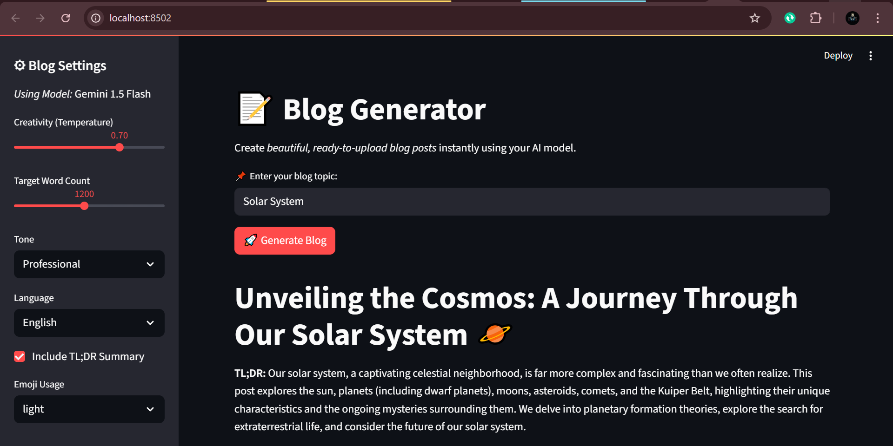
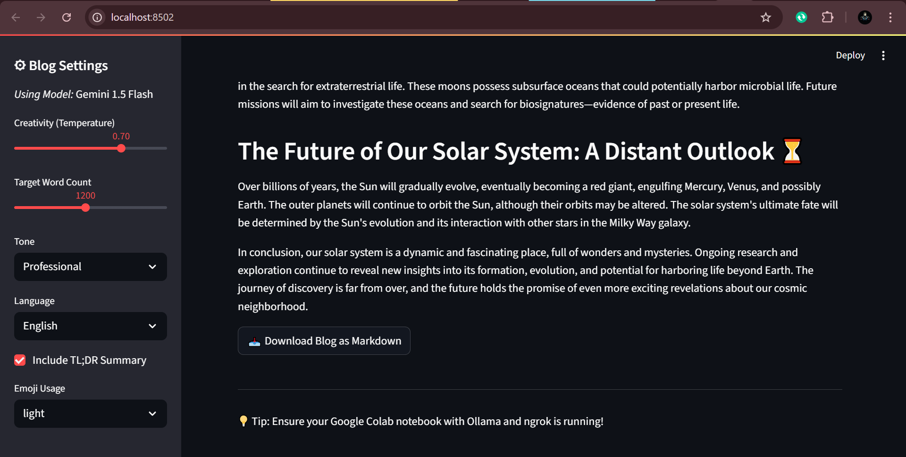

# 📝 AI Blog Generator (Streamlit + Google Gemini)

Create **beautiful, ready-to-upload blog posts** instantly.  
This Streamlit app uses **Google Gemini** to generate structured, Markdown-formatted blogs with headings, lists, emojis, and an optional TL;DR.

> **Stack:** Streamlit • Python • Google Gemini (via `google-generativeai`)

---

## 🌟 Features

- ✨ One-click blog generation from a topic prompt  
- 🧭 Structured output: titles, headings, subheadings, lists, and Markdown  
- 🎛 Controls for **creativity**, **tone**, **target word count**, **emoji usage**, **TL;DR**  
- 🌐 Multi-language (English, Spanish, French, German, Urdu)  
- ⬇️ Download as **Markdown**  
- 💾 Session state preservation so content doesn’t disappear on rerun

---

## 📸 Screenshots (add yours here)

> Replace the image paths with your actual files once you have screenshots.

- **Home**
  
  

- **Markdown Download**

  


---

## 📂 Project Structure

```
.
├── app.py                 # Your Streamlit app (rename if different)
├── requirements.txt       # Python deps (see below)
├── README.md              # This file
└── screenshots/           # Place your screenshot images here
    ├── home.png
    ├── settings.png
    └── generated.png
```

---

## ✅ Prerequisites

- **Python 3.9+**
- A **Google Gemini API key** from Google AI Studio  
- A terminal/shell where you can run `pip` and `streamlit`

---

## 🔐 Get Your Google Gemini API Key

1. Go to **Google AI Studio** → Create or view an API key  
2. Copy the key. We’ll add it to the app using one of the safe methods below.

> **Never** commit your key to Git or hard-code it in public repos.

---

## 🛠 Installation

1) **Clone** your repository (or place your `app.py` in a folder).  
2) Create and activate a virtual environment (recommended):
```bash
# macOS/Linux
python3 -m venv .venv
source .venv/bin/activate

# Windows (PowerShell)
py -m venv .venv
.venv\Scripts\Activate.ps1
```

3) **Install dependencies**:
```bash
pip install -r requirements.txt
```

 `requirements.txt`:
```txt
streamlit
google-generativeai
```

---

## 🔑 Add Your API Key (choose one)

Your current code has:
```python
genai.configure(api_key="YOUR_GEMINI_API_KEY")
```
Replace this with a safer pattern:

### Option A) Streamlit Secrets (recommended)
Create `.streamlit/secrets.toml`:
```toml
GEMINI_API_KEY = "your-real-api-key-here"
```

Update your code:
```python
import os
import streamlit as st
import google.generativeai as genai

# Prefer Streamlit secrets, fallback to env var
api_key = st.secrets.get("GEMINI_API_KEY", os.getenv("GEMINI_API_KEY"))
if not api_key:
    st.error("❌ Missing GEMINI_API_KEY. Add it in .streamlit/secrets.toml or as an environment variable.")
    st.stop()

genai.configure(api_key=api_key)
```

### Option B) Environment Variable
Set it before running:
```bash
# macOS/Linux
export GEMINI_API_KEY="your-real-api-key-here"

# Windows (PowerShell)
setx GEMINI_API_KEY "your-real-api-key-here"
```

And use the same code snippet above to read `GEMINI_API_KEY`.

> **Avoid** hard-coding the key in source code, especially in public repositories.

---

## ▶️ Run the App

From your project root:
```bash
streamlit run app.py
```

This opens the app in your browser (usually at `http://localhost:8501`).

---

## 🧭 How to Use

1. **Enter a blog topic** (e.g., *The Future of AI in Education*).  
2. Adjust settings in the **sidebar**:
   - **Creativity (Temperature)**: Lower = safer/more predictable, Higher = more creative
   - **Target Word Count**: Desired blog length (see note below)
   - **Tone**: Professional, Casual, Inspirational, Funny, Persuasive
   - **Language**: English, Spanish, French, German, Urdu
   - **Include TL;DR Summary**: If checked, adds a summary at the top
   - **Emoji Usage**: light / moderate / heavy
3. Click **🚀 Generate Blog** and wait a few seconds.
4. Review the output and click **📥 Download Blog as Markdown** to save it.

> **Note:** The current `generate_blog()` function **multiplies** your selected `Target Word Count` by 2. See “Customization” below if you want a 1:1 mapping.

---

## 🧩 Code Overview (key parts)

Your (simplified) generation flow:
```python
import streamlit as st
import google.generativeai as genai
import re

model = genai.GenerativeModel("gemini-1.5-flash")

def clean_output(text):
    # Removes any &lt;think&gt; ... &lt;/think&gt; blocks if present
    return re.sub(r"&lt;think&gt;.*?&lt;/think&gt;", "", text, flags=re.DOTALL).strip()

def generate_blog(topic, temperature, word_count_half, tone, language, tldr, emoji_level):
    word_count = word_count_half * 2  # ⚠ Doubles the slider value
    tldr_text = "Include a TL;DR summary at the top.\n" if tldr else ""
    emoji_text = f"Use emojis {emoji_level}ly in headings and text.\n"

    prompt = f"""
You are a professional Medium blog writer.
Write a blog post for the topic: "{topic}" in {language}.
The blog must:
- Not be less than {word_count} words
- Have some more attractive topic name not just the topic
- Be structured with headings and subheadings
- Have an engaging title with emojis
- Use attractive section headings
- Be written in a {tone} tone
- Contain about {word_count} words
- Use bullet points and numbered lists where appropriate
- Be ready to upload without further editing
- Use markdown for formatting
{tldr_text}
{emoji_text}

Write it now:
"""
    response = model.generate_content(prompt, generation_config={"temperature": temperature})
    return response.text  # Optionally: clean_output(response.text)
```

---

## 🛠 Customization & Tips

### 1) Word Count Slider (remove doubling)
If you want the slider to reflect the **actual** word count, remove the `* 2`:
```python
# Before:
word_count = word_count_half * 2

# After:
word_count = word_count_half
```

### 2) Hide Model “thinking” tags (if any)
You already have `clean_output()`. Apply it before displaying:
```python
st.session_state.blog_content = clean_output(
    generate_blog(topic, temperature, word_count, tone, language, tldr, emoji_level)
)
```

### 3) Change the Model
You can switch to a different Gemini model:
```python
model = genai.GenerativeModel("gemini-1.5-pro")  # or another available model
```

### 4) Add More Languages
Extend the language list in the sidebar:
```python
language = st.sidebar.selectbox("Language", ["English", "Spanish", "French", "German", "Urdu", "Arabic", "Italian"])
```

### 5) Strengthen Safety / Style
Add more constraints to the prompt (e.g., add a call to action, citations, SEO keywords, etc.).

---

## ☁️ Deploy (Streamlit Community Cloud)

1. Push your code to a **GitHub** repository.  
2. Go to share.streamlit.io and **Deploy an app** using your repo.  
3. In the app’s **Settings → Secrets**, add:
   ```
   GEMINI_API_KEY = your-real-api-key
   ```
4. Click **Deploy**. Your app will be available at a public URL.
---

## ❓ FAQ

**Q: I see “⚠ Could not connect to Gemini API”**  
- Check your API key is set (Secrets or `GEMINI_API_KEY`)  
- Verify your key is valid and you have quota in Google AI Studio  
- Ensure you have internet connectivity  
- Try lowering request frequency to avoid rate limits

**Q: Output is too short/long**  
- Adjust the **Target Word Count** (and remove the `* 2` multiplier if you want exact control)  
- Increase/decrease **Temperature**  
- Modify the prompt’s constraints

**Q: Emojis not showing?**  
- Some environments/fonts may render differently. Try a different browser or font.

---

## 🧰 Troubleshooting

- **Streamlit not found:** `pip install streamlit`  
- **google-generativeai not found:** `pip install google-generativeai`  
- **Emoji rendering issues:** Use a modern browser (Chrome, Edge, Firefox)  
- **Language-specific formatting (e.g., Urdu):** Markdown supports RTL text, but alignment may vary by viewer.

---

## 🛡 Security Notes

- Do **not** commit API keys to Git.  
- Use **Streamlit Secrets** or OS **environment variables**.  
- Treat generated content as **unreviewed drafts**—fact-check before publishing.

---

## 🙌 Acknowledgments

- Streamlit for an awesome app framework  
- Google **Gemini** API (via `google-generativeai`) for text generation

---
